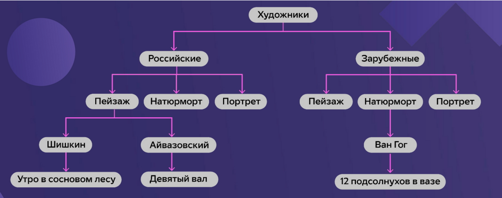

# Общая информация о базах данных
    Базы данных нужны для хранения, обработки и быстрого извлечения необходимой информации.
## Примеры баз данных:
- картотека
- результаты переписи
- библиотеки
- книги учёта

# Виды баз данных
## 1. Иерархичекие - сценарий использования этой базы изначально зафиксирован.

Например, ниже представлена иерархическая база данных картинной галереи.

Иерархическая модель удобна, если она создаётся под конкретную задачу. Например, по данной модели каталога картин удобно находить все картины российских художников или конкретный жанр картин российских художников.

Чем выше в иерархии расположена нужная нам информация, тем удобнее пользоваться этой иерархической структурой.

*Главное ограничение иерархической структуры — отсутствие гибкости.Она сразу определяет сценарий использования данных.*

## 2. Реляционные -  (от англ. Relation – связь) — базы данных, в которых данные распределены по отдельным, но связанным между собой таблицам.

Ниже представлен пример телефонного справочника.

    При связке нескольких таблиц необходим уникальный идентификатор.

*Первичный ключ — ID, уникальная информация, которая позволяет идентифицировать каждую конкретную запись таблицы.*

*Внешний ключ — ID из дополнительной таблицы (уже не уникальный). Позволяет найти информацию из основной таблицы.*

# Извлечение данных из таблиц.

## SQL – это особый язык программирования, который позволяет формулировать то,что нужно сделать с данными в таблицах.

1. **SELECT * FROM**

**SELECT** – «выбери»;

"*" – после SELECT указывается набор столбцов, * означает что мы хотим видеть все столбцы;

**FROM** – «из» указываем, откуда необходимо выбрать информацию.

**WHERE** - условие, по которому будут выбираться данные.

## Есть несколько способов, как можно соединить таблицы.

